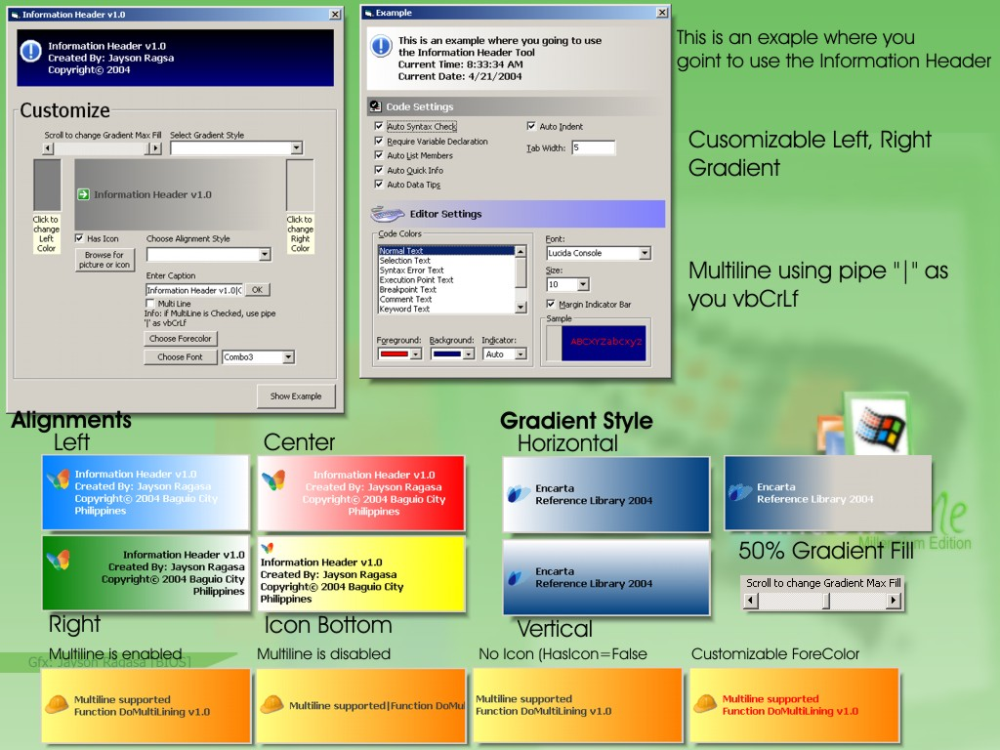



## Information Header v1\.0

### Description

Customizable header you can use in your programs. just see the screen shot for details.. tnx!

like the program? vote for it... tnx! :)
 
### More Info
 

             |
---                |---
**Submitted On**   |2004-04-20 18:28:34
**By**             |[djaymix](https://github.com/Planet-Source-Code/PSCIndex/blob/master/ByAuthor/djaymix.md)
**Level**          |Intermediate
**User Rating**    |4.4 (22 globes from 5 users)
**Compatibility**  |VB 5\.0, VB 6\.0
**Category**       |[Custom Controls/ Forms/  Menus](https://github.com/Planet-Source-Code/PSCIndex/blob/master/ByCategory/custom-controls-forms-menus__1-4.md)
**World**          |[Visual Basic](https://github.com/Planet-Source-Code/PSCIndex/blob/master/ByWorld/visual-basic.md)
**Archive File**   |[Informatio1735954212004\.zip](https://github.com/Planet-Source-Code/djaymix-information-header-v1-0__1-53304/archive/master.zip)

